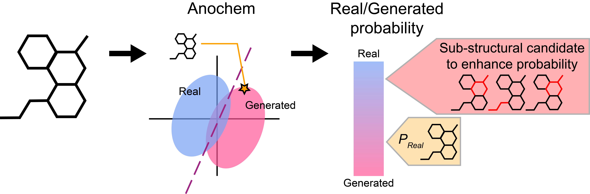

# AnoChem

## Installation

Clone the github repository of AnoChem.

AnoChem is implemented with `conda` environment. For creation of conda environment,

`conda create -n ${ENV_N} python=3.7 -y`

Activation of conda environment
`conda activate ${ENV_N}`

`bash install.sh` for primary installation of dependencies

For manual installation, create conda environment with those packages:

- `tensorflow=2.7.0` `rdkit=2022.9.3` `openbabel` `PyFingerprint`
- `scipy` `scikit-learn` `pandas` `numpy`
- `tqdm` `ipython` ``

Some dependencies are required for for manual installation:

- `PyFingerprint` : Try installation via pip and git as described in the `install.sh`

## How to run

#### General usage

For the activation of environment: `conda activate scaffold`

For the usage of AnoChem, try:

`python main.py -i INPUT_FILE -o OUTPUT_DIRECTORY`

`INPUT_FILE` should contain SMILES of chemical structures.

`OUTPUT_DIRECTORY` is the location of result output directory, default is `./results`

For the results,
- `OUTPUT_DIRECTORY/anochem_score.csv` : the final score
- `OUTPUT_DIRECTORY/final_report.csv` : detailed subscores

#### Generating images of ECFP4 bits to revise

For the inspection of substructural candidates of SMILES, generating substructural images, try:

`python main.py -i INPUT_FILE -o OUTPUT_DIRECTORY -b NUMBER_OF_IMAGES`

`NUMBER_OF_IMAGES` is the number of images for a SMILES to be generated.

Result images is created at `OUTPUT_DIRECTORY/SMILES_ORDER_NO/~`, in order of priority. Each SMILES is numbered in order as the `INPUT_FILE`, and the `SMILES_ORDER_NO` follows this.

#### Example

For your information, there is a test input file, try:

`python main.py -i input/test.smi -o results -b 5`

## Contact

For more information : check [CSB_Lab](https://www.csb-lab.net/)

